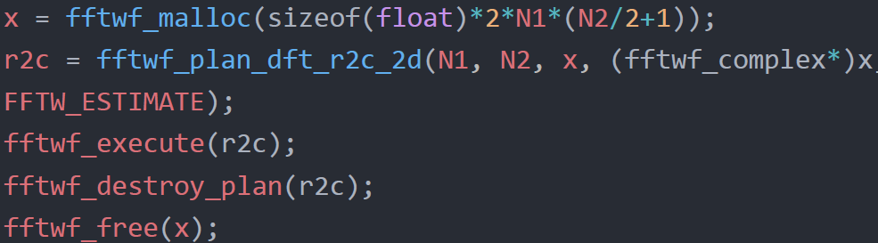
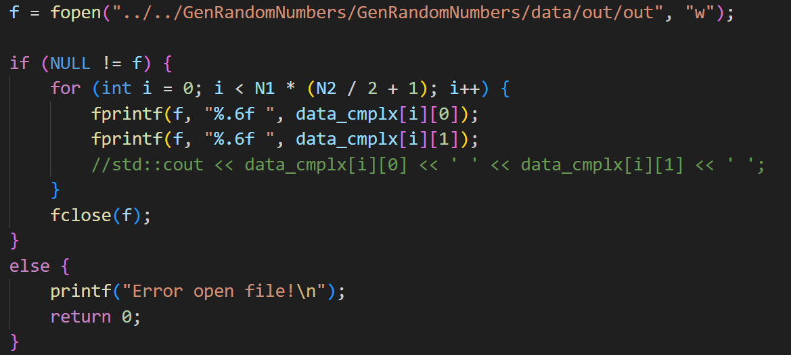
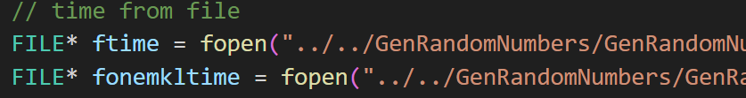
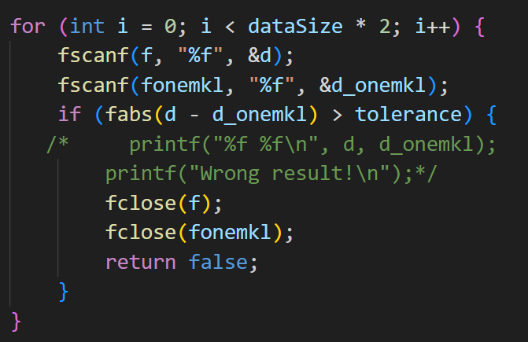

# InteloneAPIHackathon
## Introduction
It has been significantly changed by **technology** in our daily life, and everything can be easily connected and accessed through just one **click**.  
**oneAPI**, created by **Intel** company, which has great potential in building various innovative solutions is such a cross architecture programming model. For instance, oneMKL(oneAPI Math Kernel Library) is committed to accelerate and optimize mathmetical engineering problems.
## Problem
Use the oneMKL tool to accelerate and optimize the **FFT algorithm**.
1. Click on the link to download and use the latest version of oneMKL.
2. Call the corresponding API function of oneMKL to generate 2048 * 2048 random single precision real numbers;
3. Implement a 2d Real to complex FFT reference code based on the random data generated by step 2 as input;
4. Based on the random data generated by step 2 as input, use the oneMKL API to calculate the 2d Real-to-complex FFT;
5. Verify the correctness of the results, compare the full data of the 2d FFT output data calculated on step 3 and step 4 (appropriate accuracy errors allowed), and output "correct" or "incorrect" information;
6. Compare average performance data (such as running 1000 times), output FFT reference code average runtime and oneMKL FFT average runtime.
## Solution Outline
1. Generate **2048*2048** random data. Code is as below.  
    ``` cpp 
        VSLStreamStatePtr stream;  
        vslNewStream(&stream, VSL_BRNG_MT19937, 666);  
        vsRngUniform(VSL_RNG_METHOD_UNIFORM_STD, stream,  size, data.data(), 0.0f, 1.0f);  
        vslDeleteStream(&stream);
    ```
2. Real to complex FFT programming.  
    - download FFTW libs from **fftw.org**.
    - use the default env in visual studio.
    - make programming as below.  
    - use the **chrono** lib to compute the time betwenn the beginning of the execute and after being executed.
    - output the consumming time and the result.
    - put all of them into the disk in oneself device.
3. Use onemkl to do Real to complex FFT programming.  
at the very beginning, honestly speaking, it's greatly like the step2, but through fftw in **onemkl**. So code is the same, but output file name only.  
4. Compare the results between step 2 and step 3.
   - use the **fopen** in c standard to get datas from step 2 and step 3 like this.
    - use the **for** function to compare the results between fftw and fftw in onemkl one by one.
    - if there was wrong value, return the **wrong value** information, or pass the test.
5. Output the consumming time of step 2 and step 3.  
In this step, graphics is used to be presented vividly.
## Experience from My Own
First of all, deviding some projects is a good choice to build up this whole projects because of the different compiles. However **namespace** is not working during this project, I do think it's a better choice. I searched the Internet, but did not get any good solution for different compiles in only one project, maybe I have a long way to achieve it. Secondly, **Class** is not no used in this project, but it's of a significant technic for us programmers to have a better understanding. Thirdly, it's so quick through the **oneMKL**, so being widely used is essential in my coding life.